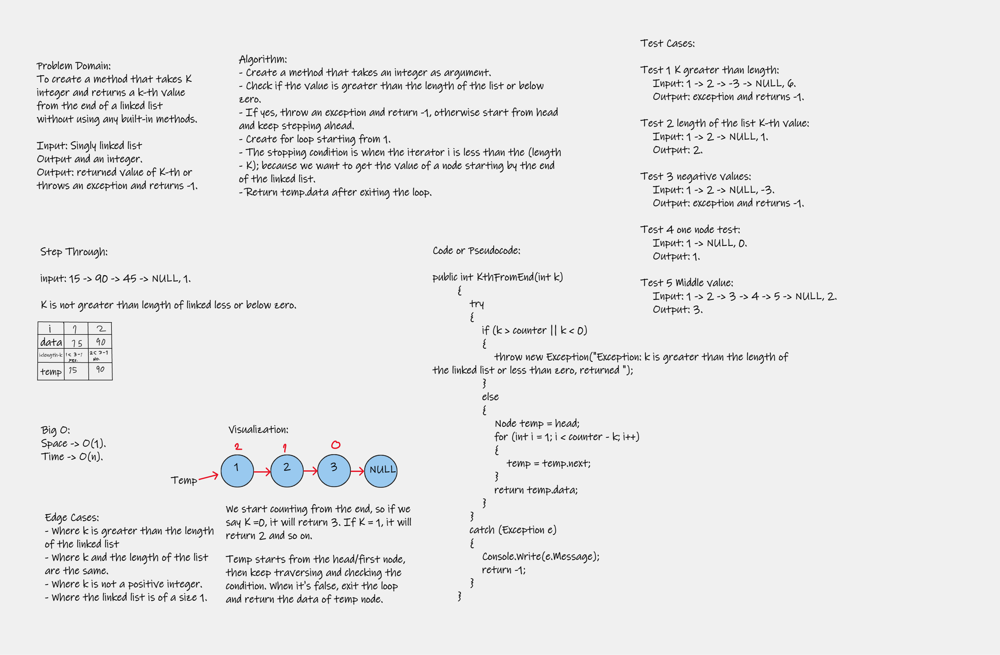

# Challenge Summary
Create a method that takes an integer as argument and returns k-th value from the end of a linked list without using any built-in methods.

---
## Whiteboard Process


---
## Approach & Efficiency
I used for loop to traverse the linked list and created a counter so when I create a new node, I increment the counter by one. The solution is to keep traverseing linked list length - K, which is the location of the searched element since it starts from the end of a linked list. If K is greater than the length or below zero, it will throw an exception and return -1. It costs Big O(n) for time complexity and Big O(1) for space complexity.

## Solution
```
public int KthFromEnd(int k)
        {
            try
            {
                if (k > counter || k < 0)
                {
                    throw new Exception("Exception: k is greater than the length of the linked list or less than zero, returned ");
                }
                else
                {
                    Node temp = head;
                    for (int i = 1; i < counter - k; i++)
                    {
                        temp = temp.next;
                    }
                    return temp.data;
                }
            }
            catch (Exception e)
            {
                Console.Write(e.Message);
                return -1;
            }
        }
```